### components
- bottomnavigation 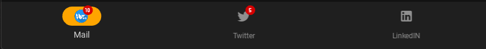
- card swipe 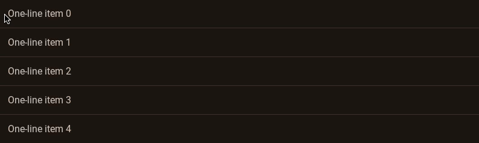
    - for showing tasks
    - cicular tick to mark on the left 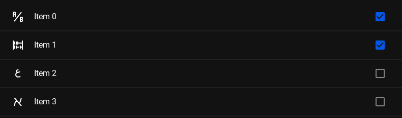
    - on the right part the deration should be shown
    - show lines from descrioption 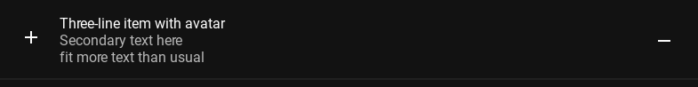
    - `scrollview` applicable
    - `Selection` action supported 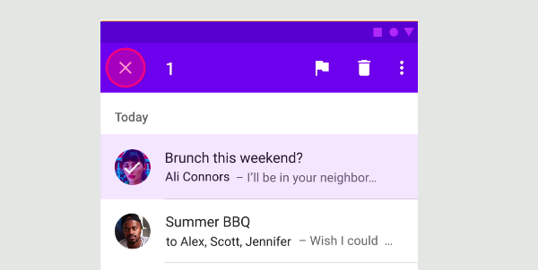
- MDFloatingActionButton 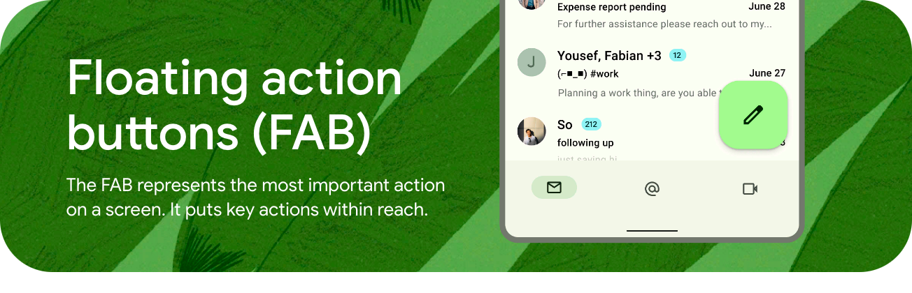 to add new task
- datepicker 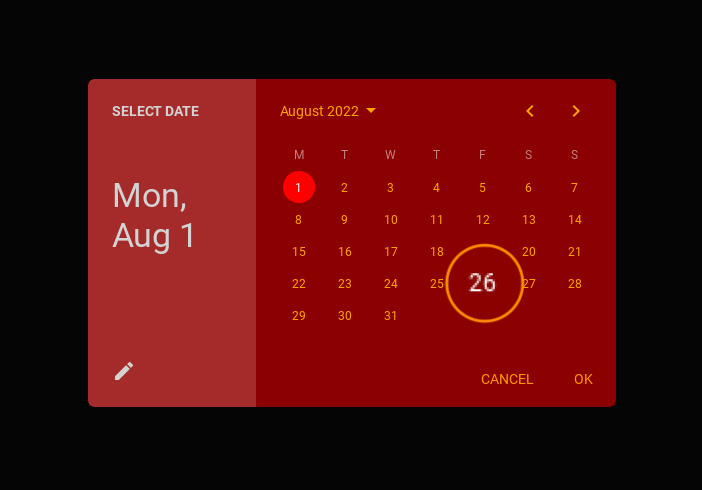 show tasks on that date on the left
- `TimePicker` 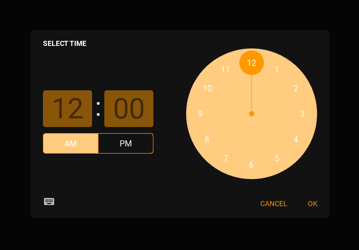
- dialog box 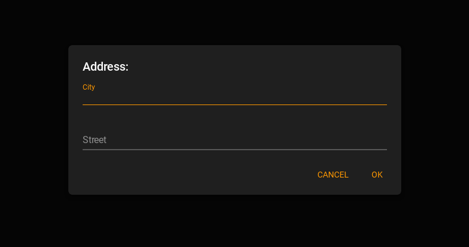 
    - for task name and time duration 
    - showing any exception 
- ExpantionPanel 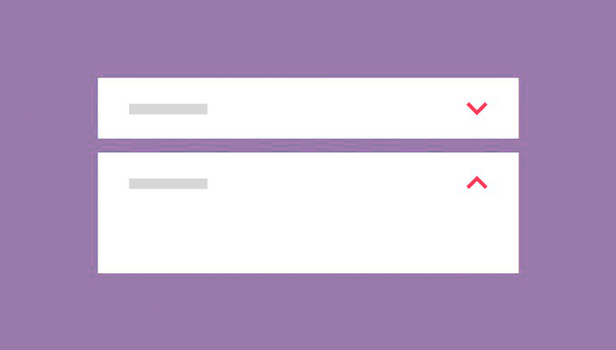 description section bellow each task. also there should be optioon to convert descrioption to note (later todo )
- Navigation drawer 
- `Snackbar` for short message 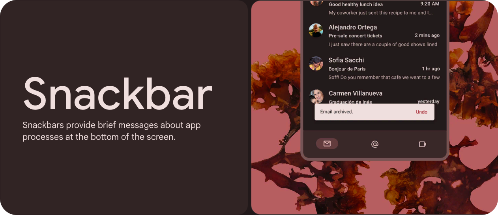
- `Spinner` -> circuler process bar 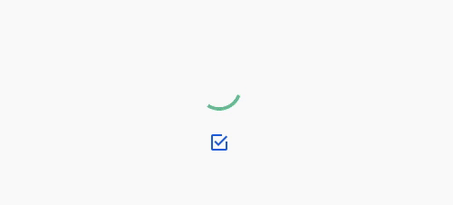
- `Tagbar` for showing months, date,, years 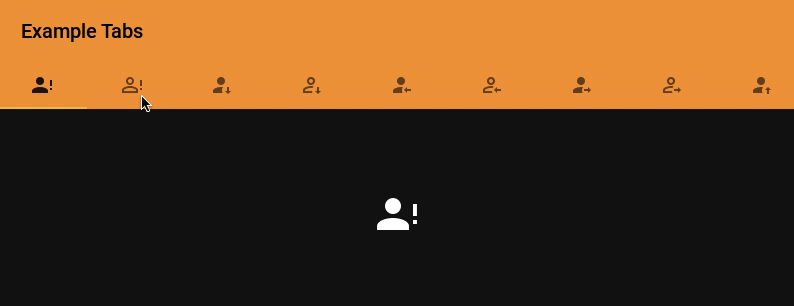
- or swipe view 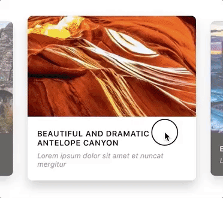
-  for showing app name
- `tooltip` -> hover over text 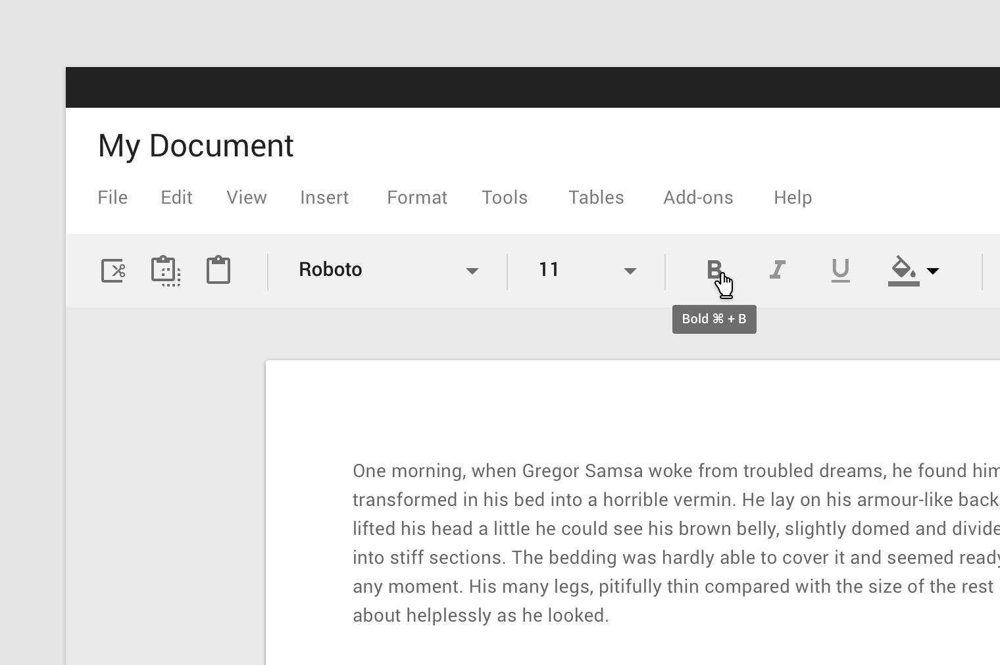
